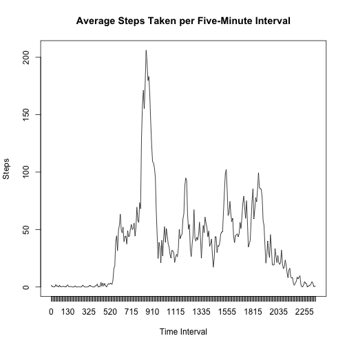

## Loading and preprocessing the data

To begin, we load the provided data into the `activity` data frame.


```r
data_filename <- unzip("activity.zip")
activity <- read.csv(
  file        = data_filename, 
  colClasses  = c("integer", "Date", "integer")
)
```

## What is the mean total number of steps taken per day?

After calculating the daily total number of steps, the mean and median number of daily steps are calculated.


```r
steps_per_day         <- with(activity, tapply(steps, date, sum, na.rm = T))
steps_per_day.hist    <- hist(steps_per_day,    plot = FALSE)
steps_per_day.mean    <- mean(steps_per_day,   na.rm = TRUE)
steps_per_day.median  <- median(steps_per_day, na.rm = TRUE)
```

The **mean** number of steps per day is 
9354 (rounding up),
and the **median** number of steps per day is 
10395.

See below for a histogram of the daily total number of steps, with the mean and median plotted in red and blue, respectively.


```r
plot(steps_per_day.hist)
abline(v = steps_per_day.mean,   col = "red",  lty = "dashed")
abline(v = steps_per_day.median, col = "blue", lty = "dotted", lwd = 2)
```

 

## What is the average daily activity pattern?

The average number of steps taken at each five-minute interval are calculated and plotted as a time series below.  


```r
# calculate average steps per interval
mean_steps_per_interval <- tapply(
  activity$steps,
  activity$interval,
  mean,
  na.rm = TRUE
)

# plot average steps per interval
plot(
  x     = mean_steps_per_interval,
  type  = "l", 
  main  = "Average Steps Taken per Five-Minute Interval",
  xlab  = "Time Interval",
  xaxt  = "n",
  ylab  = "Steps"
)

# change x-axis labels to reflect values, not indices
xnames <- names(mean_steps_per_interval)
axis(1, at=1:length(xnames), labels=xnames)
```

 

The interval that has the highest average number of steps taken across all days in the data set is:

```r
names(which.max(mean_steps_per_interval))
```

```
## [1] "835"
```

## Inputting missing values

### Calculating number of missing values

There are some entries for which the `steps` value is missing:

```r
sum(is.na(activity$steps))
```

```
## [1] 2304
```

### Filling in missing values

To address these missing values, we create a new data set (`revised_activity`) in which each missing number of steps is replaced with the average number of steps for the five-minute interval in question.  That is, each missing value for steps at interval "0" is replaced with the average number of steps at the "0" interval, etc.


```r
revised_activity <- activity

for (i in unique(revised_activity$interval)) {
  revised_activity[revised_activity$interval == i, ]$steps <- ifelse(
    is.na(revised_activity[revised_activity$interval == i, ]$steps), 
    mean_steps_per_interval[as.character(i)], 
    revised_activity[revised_activity$interval == i, ]$steps
  )
}
```

The total, mean, and median number of steps per day are calculated below:


```r
revised_steps_per_day <- with(revised_activity, 
  tapply(steps, date, sum, na.rm = TRUE)
)
revised_steps_per_day.hist    <- hist(revised_steps_per_day,    plot = FALSE)
revised_steps_per_day.mean    <- mean(revised_steps_per_day,   na.rm = TRUE)
revised_steps_per_day.median  <- median(revised_steps_per_day, na.rm = TRUE)
```

Both the **mean** and **median** number of steps per day have changed, and they also happen to be equal to each other:

```r
print(revised_steps_per_day.mean)
```

```
## [1] 10766.19
```

```r
print(revised_steps_per_day.median)
```

```
## [1] 10766.19
```

The revised **total** number of steps is plotted below:


```r
plot(revised_steps_per_day.hist)
abline(v = revised_steps_per_day.mean,   col = "red",  lty = "dashed")
abline(v = revised_steps_per_day.median, col = "blue", lty = "dotted", lwd = 2)
```

 

## Are there differences in activity patterns between weekdays and weekends?

A `daytype` factor is added, to differentiate entries for weekdays versus those for the weekend.


```r
revised_activity$daytype <- factor(ifelse(
  weekdays(revised_activity$date) %in% c("Saturday", "Sunday"),
  "weekend",
  "weekday"
))
```

The new factor is used to calculate the average number of steps by interval and daytype.


```r
mean_steps_by_interval_and_daytype <- aggregate(
  revised_activity$steps,
  list(
    interval = revised_activity$interval,
    daytype = revised_activity$daytype
  ),
  mean,
  na.rm = TRUE
)
```

The average number of steps by interval and daytype is plotted below as a time series.  As can be seen, the activity ebbs and flows throughout most of the day during the weekend, compared to the single mid-morning peak during the work week.


```r
library(lattice)
xyplot(
  x ~ interval | daytype, 
  data = mean_steps_by_interval_and_daytype, 
  layout = c(1,2),
  type = "l",
  ylab = "number of steps"
)
```

 
